# Rapport de Projet : Déploiement de 3 applications Django avec Docker & Kubernetes

**Auteur :** RATEB
**Date :** 5 mars 2026
**Environnement :** macOS, Minikube, Docker (Colima), kubectl

---

## Table des matières

1. [Introduction](#1-introduction)
2. [Présentation des applications](#2-présentation-des-applications)
3. [Partie 1 : Docker](#3-partie-1--docker)
4. [Partie 2 : Kubernetes](#4-partie-2--kubernetes)
5. [Stripe et paiement de test](#5-stripe-et-paiement-de-test)
6. [Schéma d'architecture](#6-schéma-darchitecture)
7. [Conclusion](#7-conclusion)

---

## 1. Introduction

Ce projet a été réalisé dans le cadre d'un TP portant sur la conteneurisation et l'orchestration d'applications web. Le but : déployer **trois applications Django** dans un cluster Kubernetes local, en passant d'abord par Docker, puis par Kubernetes.

J'avais déjà utilisé Docker dans d'autres projets (notamment pour faire tourner des conteneurs simples avec `docker run`), mais c'est la première fois que je déploie plusieurs applications sur Kubernetes avec des namespaces, des ConfigMaps et des Secrets. Du coup, une bonne partie du TP a été de l'apprentissage en temps réel, en lisant la doc et en testant des commandes kubectl.

Côté outils, j'ai utilisé **Minikube** comme cluster local car il est léger et bien documenté, et surtout parce qu'il tourne bien sur macOS ARM (Apple Silicon M1). Pour Docker, j'ai dû passer par **Colima** comme runtime car Docker Desktop n'était pas disponible sur ma machine, et ça m'a d'ailleurs posé quelques soucis de configuration au départ.

L'idée du projet est de simuler un environnement réaliste avec trois environnements séparés (dev, preprod, prod), chacun dans son propre namespace Kubernetes. L'application de production intègre en plus Stripe pour tester un flux de paiement.

---

## 2. Présentation des applications

Les trois applications déployées sont toutes basées sur le framework **Django** et proviennent du catalogue open source d'AppSeed. J'ai choisi Django car c'est un framework Python mature, avec un ORM intégré, un système d'authentification prêt à l'emploi et une architecture MVC claire, ce qui facilite la conteneurisation.

### 2.1 Django Star Admin (environnement dev)

Django Star Admin est un tableau de bord d'administration basé sur le template Star Admin. Il fournit une interface avec des graphiques, des tables de données dynamiques et un système d'API REST auto-générée. J'ai placé cette application dans le namespace `dev` car c'est un dashboard simple, sans données critiques, idéal pour un environnement de développement.

- **Framework :** Django 4.x avec Python 3.9
- **Serveur WSGI :** Gunicorn (port 5005)
- **Base de données :** SQLite (embarquée)
- **Namespace Kubernetes :** `dev`

### 2.2 Django AdminLTE (environnement preprod)

Django AdminLTE est une application d'administration basée sur le thème AdminLTE, un template Bootstrap très répandu. Elle offre des pages pré-construites (tableaux, formulaires, calendrier) et un système d'authentification complet. J'ai choisi de la placer en `preprod` car elle représente un back-office d'administration qui nécessite des tests de validation avant mise en production.

- **Framework :** Django 4.x avec Python 3.9
- **Serveur WSGI :** Gunicorn (port 5005)
- **Base de données :** SQLite (embarquée)
- **Namespace Kubernetes :** `preprod`

### 2.3 Rocket eCommerce (environnement prod)

Rocket eCommerce est une application e-commerce complète avec catalogue produits (Shoes, T-Shirts, Pants), panier d'achat, système d'authentification utilisateur et intégration de paiement via **Stripe**. C'est l'application la plus complexe du projet : elle utilise Python 3.11, nécessite Node.js pour la compilation des assets front-end (Tailwind CSS via Webpack), et intègre Celery/Redis pour les tâches asynchrones. J'ai placé cette application dans le namespace `prod` car elle simule un vrai site marchand exposé aux utilisateurs finaux.

- **Framework :** Django 4.2.9 avec Python 3.11
- **Serveur WSGI :** Gunicorn (port 5005)
- **Front-end :** Tailwind CSS, Webpack, Node.js
- **Paiement :** Stripe (mode test)
- **Base de données :** SQLite (embarquée)
- **Namespace Kubernetes :** `prod`

---

## 3. Partie 1 : Docker

### 3.1 Les Dockerfiles

Chaque application possède son propre Dockerfile à la racine de son répertoire. J'ai utilisé des images de base **Python slim** car elles offrent un bon compromis entre taille d'image réduite et compatibilité avec les dépendances Python, contrairement aux images `alpine` qui posent parfois des problèmes de compilation avec certaines bibliothèques C.

#### Dockerfile de Django Star Admin et Django AdminLTE

Ces deux applications partagent un Dockerfile identique car elles ont la même structure :

```dockerfile
FROM python:3.9-slim

ENV PYTHONDONTWRITEBYTECODE 1
ENV PYTHONUNBUFFERED 1

COPY requirements.txt .
RUN pip install --upgrade pip && pip install --no-cache-dir -r requirements.txt

COPY . .

CMD ["gunicorn", "--config", "gunicorn-cfg.py", "config.wsgi"]
```

**Pourquoi ces choix :**

J'ai pris `python:3.9-slim` car l'image complète fait environ 900 Mo contre ~150 Mo pour la slim, et on n'a pas besoin de tout ce qui est dedans (compilateurs C, etc.). Python 3.9 parce que c'est la version requise par les dépendances des deux apps.

Les deux variables d'environnement `PYTHONDONTWRITEBYTECODE=1` et `PYTHONUNBUFFERED=1` sont assez classiques en Docker. La première empêche Python de créer des fichiers `.pyc` (inutiles dans un conteneur qui est éphémère), la seconde fait en sorte que les logs s'affichent en temps réel dans `docker logs` et `kubectl logs` sans être mis en tampon. Sans ça, en cas de crash on risque de perdre les dernières lignes de log.

Le flag `--no-cache-dir` sur pip évite de garder les packages téléchargés en cache dans l'image, ce qui la rend plus légère.

Pour Gunicorn, c'est simple : le serveur de développement de Django (`manage.py runserver`) n'est pas fait pour la production, il ne gère pas bien le trafic concurrent. Gunicorn est le standard pour servir du Django en prod.

#### Dockerfile de Rocket eCommerce

```dockerfile
FROM python:3.11-slim

ENV PYTHONDONTWRITEBYTECODE 1
ENV PYTHONUNBUFFERED 1

RUN apt-get update && apt-get install -y \
    ca-certificates curl gnupg nodejs npm \
    && rm -rf /var/lib/apt/lists/*

WORKDIR /app

COPY requirements.txt .
RUN pip install --upgrade pip && pip install --no-cache-dir -r requirements.txt

COPY . .

RUN npm i && npm run build
RUN python manage.py collectstatic --no-input

CMD ["gunicorn", "--config", "gunicorn-cfg.py", "core.wsgi"]
```

**Ce qui change par rapport aux deux autres :**

Cette app est plus complexe, donc le Dockerfile est plus chargé. Déjà, `python:3.11-slim` au lieu de 3.9 car certaines dépendances (Django REST Framework récent, Stripe SDK) nécessitent Python 3.10+.

L'installation de `nodejs` et `npm` via apt est nécessaire car Rocket eCommerce utilise Tailwind CSS compilé via Webpack. Le build front-end (`npm run build`) génère les fichiers CSS et JS optimisés. J'ai ajouté `rm -rf /var/lib/apt/lists/*` juste après pour virer le cache apt et gagner environ 30 Mo sur l'image.

J'ai mis un `WORKDIR /app` car avec tous les sous-dossiers de cette application (home/, core/, docs/, tasks_scripts/), c'est plus propre d'avoir un répertoire de travail explicite.

`collectstatic --no-input` rassemble tous les fichiers statiques dans un seul dossier pour que WhiteNoise puisse les servir en production. Et le `core.wsgi` (au lieu de `config.wsgi` pour les deux autres) correspond simplement au nom du module de configuration Django de cette application.

### 3.2 Le fichier docker-compose.yaml

J'ai créé un fichier `docker-compose.yaml` centralisé dans le dossier `docker/` pour pouvoir lancer les trois applications simultanément en une seule commande :

```yaml
services:

  django-adminlte-ra-05-03-2026:
    build: ../django-adminlte
    container_name: django-adminlte-ra-05-03-2026
    ports:
      - "5001:5005"
    env_file:
      - ../django-adminlte/env.sample

  django-star-ra-05-03-2026:
    build: ../django-star-admin
    container_name: django-star-ra-05-03-2026
    ports:
      - "5002:5005"
    env_file:
      - ../django-star-admin/env.sample

  rocket-ecommerce-ra-05-03-2026:
    build: ../priv-rocket-ecommerce-main
    container_name: rocket-ecommerce-ra-05-03-2026
    ports:
      - "5003:5005"
    env_file:
      - ../priv-rocket-ecommerce-main/.env
```

**Quelques explications :**

Les trois applications écoutent toutes en interne sur le port 5005 (c'est configuré dans `gunicorn-cfg.py`), donc j'ai mappé des ports hôtes différents (5001, 5002, 5003) pour pouvoir y accéder en parallèle sans conflit depuis le navigateur (`localhost:5001`, `localhost:5002`, `localhost:5003`).

J'ai utilisé `env_file` plutôt que de mettre les variables d'environnement en dur dans le compose, pour séparer la configuration sensible (SECRET_KEY, clés Stripe) du code source. Les fichiers `.env` sont dans le `.gitignore`, ce qui évite de les pousser sur Git par accident.

Les chemins `build: ../` pointent vers les répertoires parents car le `docker-compose.yaml` est dans un sous-dossier `docker/`. Et pour le nommage des conteneurs avec le suffixe `ra-05-03-2026`, c'est juste pour identifier facilement cette session de TP et éviter les conflits avec d'anciens conteneurs.

### 3.3 Construction et vérification

Les images ont été construites et les conteneurs lancés via :

```bash
cd docker
docker-compose up --build -d
docker-compose ps
docker-compose logs -f
```

Les trois conteneurs ont démarré correctement, chacun avec Gunicorn en écoute sur le port 5005.

---

## 4. Partie 2 : Kubernetes

### 4.1 Mise en place du cluster Minikube

J'ai configuré Minikube avec les paramètres suivants :

```bash
minikube start --driver=docker --listen-address=0.0.0.0 \
  --memory=max --cpus=max --kubernetes-version=v1.35.0
```

Le driver Docker est le plus stable sur macOS ARM (Hyperkit ne marche pas sur Apple Silicon). J'ai mis `--memory=max --cpus=max` car avec 3 applications et 3 réplicas chacune, ça fait 9 pods à faire tourner, donc autant donner le maximum de ressources. Et `--kubernetes-version=v1.35.0` pour fixer la version et garantir que tout est reproductible.

Pour que les images Docker locales soient accessibles dans Minikube sans passer par un registre distant, j'ai utilisé :

```bash
eval $(minikube docker-env)
```

Cette commande redirige le client Docker local vers le démon Docker interne de Minikube. Ainsi, quand je construis une image avec `docker build`, elle est directement disponible dans le cluster. C'est pourquoi j'ai mis `imagePullPolicy: Never` dans mes manifests Kubernetes, justement pour empêcher Kubernetes de chercher l'image sur Docker Hub.

### 4.2 Création des namespaces

J'ai créé trois namespaces pour isoler les environnements :

```bash
kubectl create namespace prod
kubectl create namespace preprod
kubectl create namespace dev
```

L'idée derrière les namespaces, c'est d'isoler logiquement les ressources (pods, services, configmaps, secrets) entre les environnements. Ça simule une vraie infra où le code passe par dev → preprod → prod avant d'être accessible aux utilisateurs. Chaque namespace peut avoir ses propres quotas de ressources et ses propres politiques d'accès.

```bash
kubectl get namespaces
```

### 4.3 Construction des images pour Minikube

Après avoir connecté le client Docker au démon Minikube, j'ai construit les trois images :

```bash
eval $(minikube docker-env)
docker build -t django-star-ra-05-03-2026:v1 django-star-admin/
docker build -t django-adminlte-ra-05-03-2026:v1 django-adminlte/
docker build -t rocket-ecommerce-ra-05-03-2026:v1 priv-rocket-ecommerce-main/
```

J'ai tagué chaque image avec `:v1` pour versionner les builds. En production, on utiliserait un tag de commit Git ou un numéro de version sémantique, mais pour un TP, `v1` est suffisant et lisible.

### 4.4 Les manifests Kubernetes

Chaque application dispose d'un fichier YAML unique qui regroupe quatre ressources Kubernetes : un **ConfigMap**, un **Secret**, un **Service** et un **Deployment**. J'ai regroupé toutes les ressources dans un seul fichier par application (séparées par `---`) car cela simplifie le déploiement avec une seule commande `kubectl apply -f`.

#### 4.4.1 Django Star Admin (Namespace `dev`)

**Fichier :** `kubernetes/dev-django-star-ra-05-03-2026.yaml`

```yaml
apiVersion: v1
kind: ConfigMap
metadata:
  name: django-star-config-ra-05-03-2026
  namespace: dev
data:
  DEBUG: "False"
---
apiVersion: v1
kind: Secret
metadata:
  name: django-star-secret-ra-05-03-2026
  namespace: dev
type: Opaque
stringData:
  SECRET_KEY: ""
---
apiVersion: v1
kind: Service
metadata:
  name: django-star-service-ra-05-03-2026
  namespace: dev
spec:
  type: ClusterIP
  selector:
    app: django-star-ra-05-03-2026
  ports:
  - port: 5005
    targetPort: 5005
---
apiVersion: apps/v1
kind: Deployment
metadata:
  name: django-star-deployment-ra-05-03-2026
  namespace: dev
spec:
  replicas: 3
  selector:
    matchLabels:
      app: django-star-ra-05-03-2026
  template:
    metadata:
      labels:
        app: django-star-ra-05-03-2026
    spec:
      containers:
      - name: django-star-ra-05-03-2026
        image: django-star-ra-05-03-2026:v1
        imagePullPolicy: Never
        ports:
        - containerPort: 5005
        envFrom:
        - configMapRef:
            name: django-star-config-ra-05-03-2026
        - secretRef:
            name: django-star-secret-ra-05-03-2026
```

**Pourquoi ces choix :**

J'ai mis le service en `ClusterIP` pour l'environnement dev car cette app n'a pas besoin d'être accessible depuis l'extérieur du cluster. ClusterIP crée juste une adresse IP interne, c'est le type par défaut et le plus restrictif. Pour y accéder pendant le dev, on passe par `minikube ssh` puis `curl` depuis l'intérieur, ou par `kubectl port-forward`.

Les 3 réplicas c'est pour montrer que Kubernetes sait répartir la charge et assurer la haute disponibilité. Et `imagePullPolicy: Never` empêche Kubernetes d'aller chercher l'image sur Docker Hub, vu qu'elle a été construite en local dans le démon Docker de Minikube.

#### 4.4.2 Django AdminLTE (Namespace `preprod`)

**Fichier :** `kubernetes/preprod-django-adminlte-ra-05-03-2026.yaml`

La structure est identique à celle de Django Star Admin, avec deux différences. D'abord le namespace `preprod`, et surtout le service en `NodePort` au lieu de ClusterIP.

J'ai choisi NodePort pour la pré-production car ce type de service expose l'application sur un port statique du nœud du cluster. Concrètement, les testeurs et les QA peuvent y accéder depuis l'extérieur sans avoir besoin d'un load balancer complet. C'est un entre-deux entre ClusterIP (interne uniquement) et LoadBalancer (pleinement exposé), ce qui colle bien au besoin de la preprod.

#### 4.4.3 Rocket eCommerce (Namespace `prod`)

**Fichier :** `kubernetes/prod-rocket-ecommerce-ra-05-03-2026.yaml`

Cette application a des ressources supplémentaires par rapport aux deux autres :

```yaml
apiVersion: v1
kind: ConfigMap
metadata:
  name: rocket-ecommerce-config-ra-05-03-2026
  namespace: prod
data:
  DEBUG: "False"
  DEMO_MODE: "True"
---
apiVersion: v1
kind: Secret
metadata:
  name: rocket-ecommerce-secret-ra-05-03-2026
  namespace: prod
type: Opaque
stringData:
  SECRET_KEY: ""
  STRIPE_SECRET_KEY: ""
  STRIPE_PUBLISHABLE_KEY: ""
```

Le service est en `LoadBalancer` car en production, il faut une IP externe stable et une répartition du trafic automatique entre les pods. Sur un vrai cloud (AWS, GCP, Azure), Kubernetes provisionnerait un load balancer managé. Ici avec Minikube, on accède à l'app via `kubectl port-forward`, mais le principe reste le même.

Le ConfigMap contient `DEMO_MODE: "True"` en plus du `DEBUG: "False"`. Le mode démo pré-remplit le catalogue avec des produits de test. J'ai mis ça dans le ConfigMap (et pas le Secret) car ce n'est pas une donnée sensible.

Par contre, les clés Stripe (`STRIPE_SECRET_KEY` et `STRIPE_PUBLISHABLE_KEY`) sont dans un objet **Secret** car ce sont des clés d'API sensibles. Les Secrets Kubernetes sont encodés en base64 dans etcd et peuvent bénéficier de politiques RBAC plus strictes. Dans un vrai environnement de production, on utiliserait plutôt un gestionnaire de secrets externe (HashiCorp Vault, AWS Secrets Manager), mais pour ce TP les Secrets natifs font le job.

J'ai utilisé `envFrom` avec configMapRef et secretRef (au lieu de déclarer chaque variable une par une avec `env`) car ça injecte automatiquement toutes les clés comme variables d'environnement. C'est plus simple à maintenir quand on a plusieurs variables.

### 4.5 Déploiement et vérification

Les trois applications ont été déployées avec :

```bash
kubectl apply -f kubernetes/dev-django-star-ra-05-03-2026.yaml
kubectl apply -f kubernetes/preprod-django-adminlte-ra-05-03-2026.yaml
kubectl apply -f kubernetes/prod-rocket-ecommerce-ra-05-03-2026.yaml
```

#### Vérification des pods dans chaque namespace

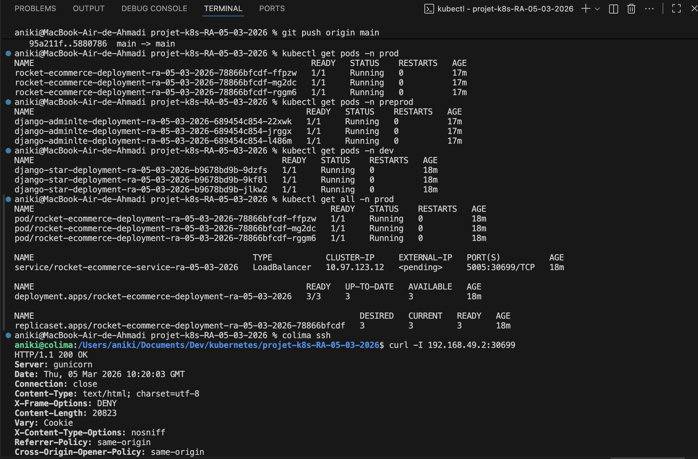

*Cette capture montre les résultats de `kubectl get pods` dans les trois namespaces. On voit 3 pods Running pour chaque application (9 pods au total), ce qui confirme que les 3 réplicas fonctionnent correctement. Le bas de la capture montre un `curl` sur l'IP du pod Rocket eCommerce en production, qui retourne un HTTP 200 avec le contenu HTML de la page d'accueil.*

#### Vérification de Django AdminLTE en preprod

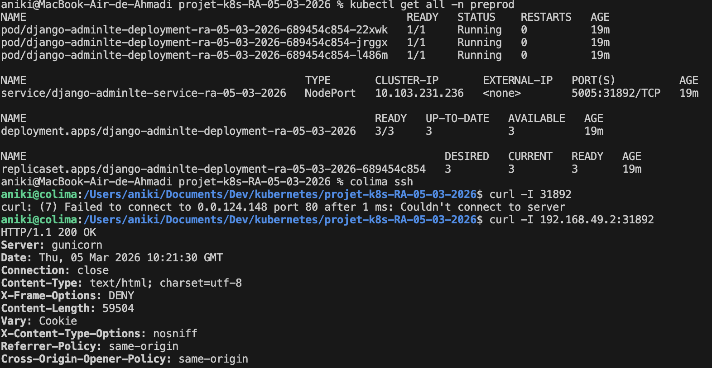

*Cette capture montre `kubectl get all -n preprod` avec le service de type NodePort sur le port 5005. Le `curl` depuis l'intérieur du cluster (via Colima) retourne un HTTP 200, confirmant que l'application répond correctement.*

#### Vérification de Django Star Admin en dev

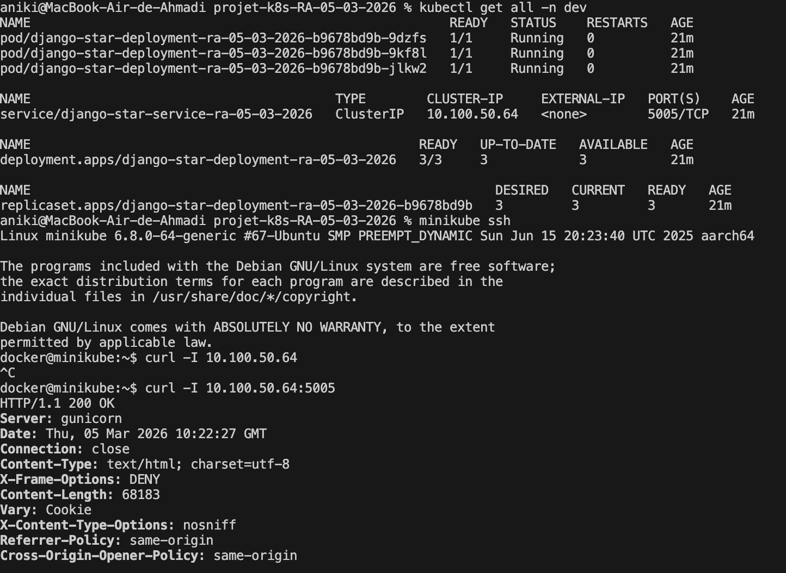

*Cette capture montre `kubectl get all -n dev` avec le service de type ClusterIP. Le test est effectué depuis l'intérieur de Minikube via `minikube ssh`, puis un `curl` vers l'IP interne du pod, qui retourne un HTTP 200.*

### 4.6 Accès aux applications via port-forward

Pour accéder aux applications depuis le navigateur local, j'ai utilisé `kubectl port-forward` :

```bash
kubectl port-forward --address 0.0.0.0 services/rocket-ecommerce-service-ra-05-03-2026 \
  8080:5005 -n prod
```

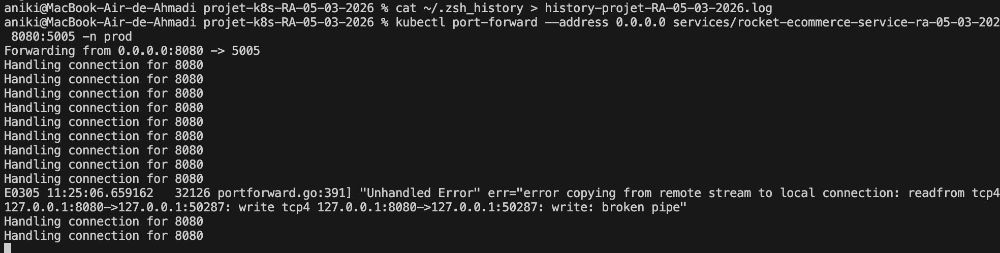

*Cette capture montre le port-forward actif sur le port 8080, avec les connexions gérées ("Handling connection for 8080"). On observe également une erreur de type "broken pipe" qui est normale : elle survient quand le navigateur ferme une connexion HTTP avant que le serveur n'ait fini de répondre (par exemple lors du rechargement rapide d'une page).*

### 4.7 Logs Kubernetes

Les logs Gunicorn récupérés via `kubectl logs` confirment le bon fonctionnement des trois applications :

**Logs Rocket eCommerce (prod) :**
```
[2026-03-05 10:01:03 +0000] [1] [INFO] Starting gunicorn 21.2.0
[2026-03-05 10:01:03 +0000] [1] [INFO] Listening at: http://0.0.0.0:5005 (1)
[2026-03-05 10:01:03 +0000] [1] [INFO] Using worker: sync
[2026-03-05 10:01:03 +0000] [7] [INFO] Booting worker with pid: 7
```

**Logs Django AdminLTE (preprod) et Django Star Admin (dev) :**
```
[2026-03-05 10:00:53 +0000] [1] [INFO] Starting gunicorn 23.0.0
[2026-03-05 10:00:53 +0000] [1] [INFO] Listening at: http://0.0.0.0:5005 (1)
```

On remarque que les logs se répètent 3 fois pour AdminLTE et Star Admin, ce qui correspond aux 3 réplicas de chaque Deployment. Un warning `No directory at: /staticfiles/` apparaît dans les logs. C'est un avertissement non bloquant de WhiteNoise indiquant que le dossier `staticfiles` n'a pas été généré (ces deux applications n'ont pas de commande `collectstatic` dans leur Dockerfile, contrairement à Rocket eCommerce). L'application fonctionne quand même car les fichiers statiques sont servis depuis un autre chemin.

---

## 5. Stripe et paiement de test

### 5.1 Configuration de Stripe

L'application Rocket eCommerce intègre le SDK Stripe (`stripe==4.2.0` dans les dépendances Python). Les clés API Stripe sont injectées via le Secret Kubernetes `rocket-ecommerce-secret-ra-05-03-2026` dans le namespace `prod` :

- `STRIPE_SECRET_KEY` : clé secrète utilisée côté serveur pour créer les sessions de paiement
- `STRIPE_PUBLISHABLE_KEY` : clé publique utilisée côté client (JavaScript) pour initialiser Stripe.js

J'ai utilisé les clés de l'**environnement de test** Stripe (préfixées par `sk_test_` et `pk_test_`), car elles permettent de simuler des transactions sans mouvement d'argent réel.

### 5.2 Parcours de test du paiement

#### Étape 1 : Page d'accueil et connexion

Après le port-forward sur `localhost:8080`, j'ai accédé à l'application Rocket eCommerce et me suis connecté avec un compte utilisateur.

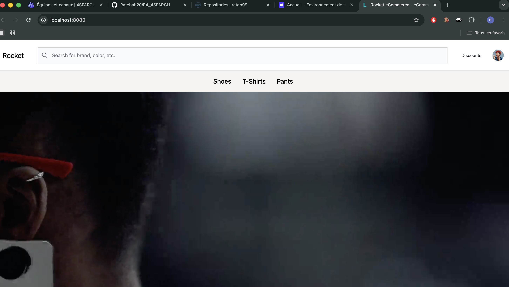

*La page d'accueil affiche le catalogue avec les catégories Shoes, T-Shirts et Pants.*

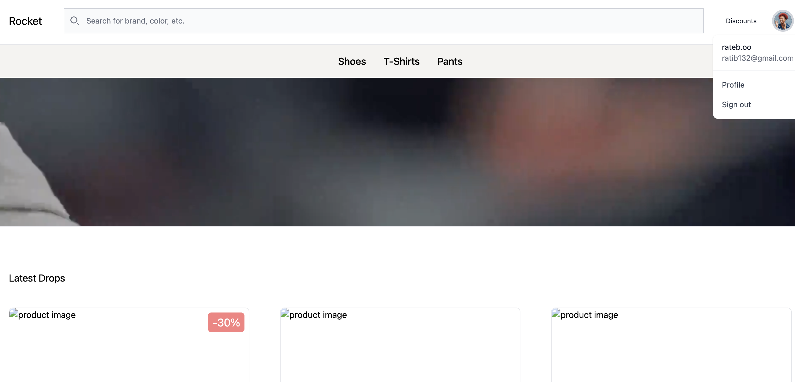

*On voit le menu utilisateur avec le profil "rateb.oo" (ratib132@gmail.com) connecté, et la section "Latest Drops" affichant les produits récents avec des promotions (-30%).*

#### Étape 2 : Ajout au panier

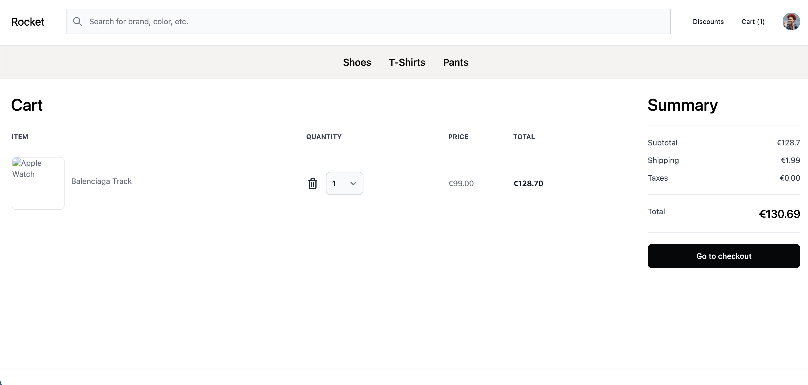

*J'ai ajouté un produit "Balenciaga Track" au panier. Le récapitulatif affiche : prix unitaire €99.00, total avec frais de port €130.69. Le bouton "Go to checkout" redirige vers la page de paiement Stripe.*

#### Étape 3 : Page de paiement Stripe (Checkout)

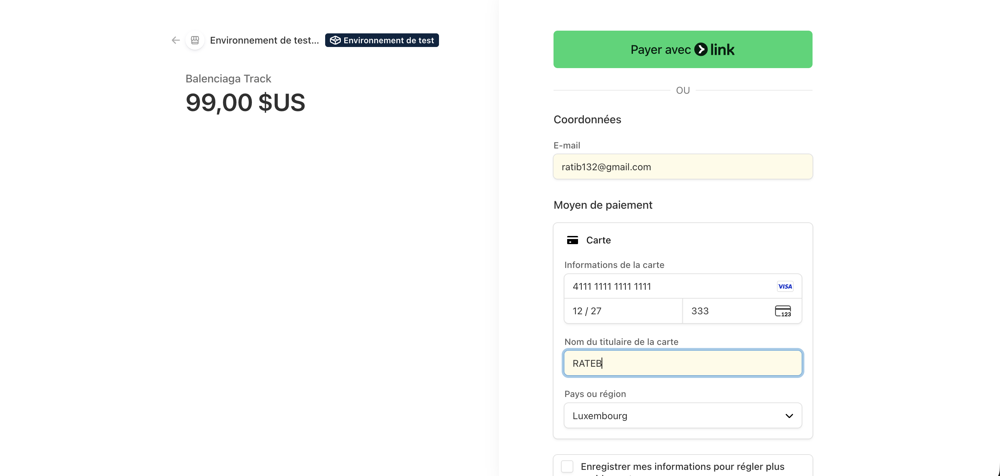

*La page de paiement Stripe s'affiche en **mode test** (visible grâce au bandeau vert "Environnement de test" en haut). J'ai rempli le formulaire avec la carte de test Stripe standard `4111 1111 1111 1111` (carte Visa de test), une date d'expiration future (12/27), un CVV quelconque (333) et le nom "RATEB". Cette carte de test est fournie par Stripe spécifiquement pour simuler des paiements réussis sans transaction bancaire réelle.*

#### Étape 4 : Retour après paiement

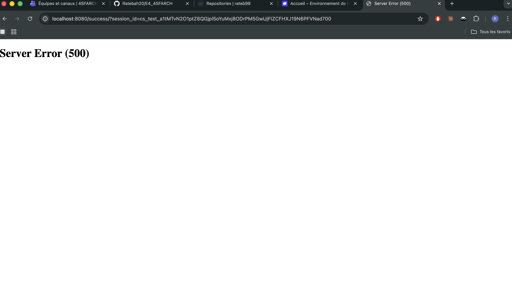

*Après la validation du paiement, Stripe redirige vers `localhost:8080/success/?session_id=cs_test_...`. Malheureusement, la page retourne une **erreur 500 (Server Error)**. Cette erreur est visible dans les logs Kubernetes :*

```
[2026-03-05 10:31:07 +0000] "GET /success/?session_id=cs_test_a1tMTvN2O1ptZ6QGjpl5oYuMxj8ODrPM5GwUjFIZCFHXJ19N6PFVNad700 HTTP/1.1" 500
```

*L'erreur 500 provient probablement d'une configuration manquante côté serveur Django (comme `DEBUG=False` sans template 500 personnalisé, ou une variable Stripe non initialisée pour récupérer les détails de la session). Le paiement a bien été effectué côté Stripe malgré cette erreur côté application.*

#### Étape 5 : Confirmation dans le tableau de bord Stripe

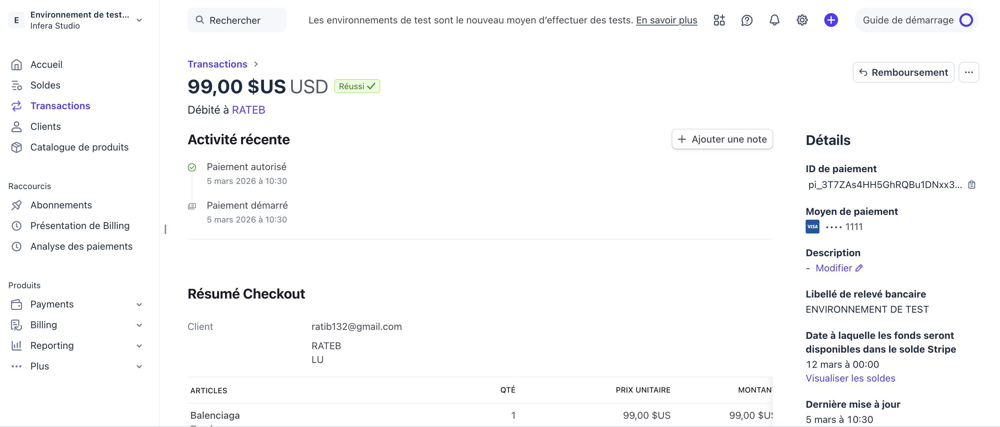

*Le tableau de bord Stripe confirme que la transaction de **99,00 $US** a bien été traitée avec succès ("Réussi ✓"). On voit les détails : paiement autorisé et démarré le 5 mars 2026 à 10:30, client ratib132@gmail.com, carte Visa se terminant par 1111, article "Balenciaga" (1 unité à 99,00 $US). Cela prouve que l'intégration Stripe fonctionne correctement du côté de la passerelle de paiement, même si la page de retour `/success/` de l'application Django renvoie une erreur 500.*

---

## 6. Schéma d'architecture

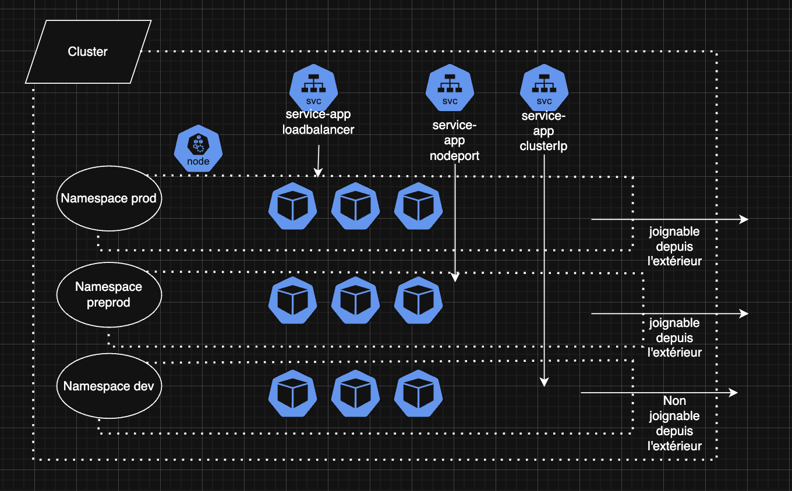

Le schéma ci-dessus illustre l'architecture complète du cluster Kubernetes avec les trois namespaces et leurs services respectifs.

### Description de l'architecture

Le cluster Minikube contient trois namespaces isolés, chacun avec un type de service différent adapté à son niveau d'exposition :

**Namespace `prod`** (Rocket eCommerce) :
Le service de type **LoadBalancer** fournit une IP externe permettant l'accès depuis l'extérieur du cluster. Il distribue le trafic entrant entre les 3 pods de l'application. En production, les utilisateurs finaux doivent pouvoir accéder au site e-commerce de manière fiable, d'où ce choix. Le schéma indique "joignable depuis l'extérieur".

**Namespace `preprod`** (Django AdminLTE) :
Le service de type **NodePort** expose l'application sur un port statique du nœud Minikube. L'accès se fait via l'IP du nœud suivie du port attribué. Ce niveau d'exposition intermédiaire est adapté à la pré-production : les testeurs peuvent y accéder mais l'application n'est pas directement exposée via un load balancer. Le schéma indique "joignable depuis l'extérieur" car le NodePort reste accessible depuis la machine hôte.

**Namespace `dev`** (Django Star Admin) :
Le service de type **ClusterIP** ne fournit qu'une adresse IP interne au cluster. L'application n'est pas accessible directement depuis l'extérieur, il faut passer par `kubectl port-forward` ou `minikube ssh` pour y accéder. C'est le choix le plus sécurisé, adapté au développement où seuls les développeurs ont besoin d'y accéder ponctuellement. Le schéma indique "Non joignable depuis l'extérieur".

### Tableau récapitulatif

| Environnement | Application        | Namespace  | Type de Service | Réplicas | Accès externe        |
|---------------|--------------------|------------|-----------------|----------|----------------------|
| Production    | Rocket eCommerce   | `prod`     | LoadBalancer    | 3        | Oui (IP externe)     |
| Pré-production| Django AdminLTE     | `preprod`  | NodePort        | 3        | Oui (IP nœud:port)   |
| Développement | Django Star Admin   | `dev`      | ClusterIP       | 3        | Non (interne)        |

---

## 7. Conclusion

Ce projet m'a surtout fait comprendre à quel point il y a un écart entre "faire tourner un conteneur Docker" et "orchestrer plusieurs applications dans Kubernetes". Docker tout seul, c'est relativement simple : on écrit un Dockerfile, on build, on run, et ça marche. Mais dès qu'on passe à Kubernetes avec des namespaces, des ConfigMaps, des Secrets et des Services de types différents, la complexité augmente vite.

**Ce que j'en retiens :**

Concrètement, ce qui m'a le plus marqué c'est la partie manifests. Avant ce TP, la différence entre ConfigMap et Secret me semblait floue. Maintenant je comprends qu'un ConfigMap c'est pour la config "normale" (DEBUG, DEMO_MODE) et un Secret pour tout ce qui est sensible (clés API, SECRET_KEY). Pareil pour les types de services : j'ai expérimenté les trois (ClusterIP, NodePort, LoadBalancer) et je vois bien comment ils s'emboîtent selon le niveau d'exposition dont on a besoin.

La partie Minikube sur macOS ARM m'a aussi appris à être patient. Entre Colima, le driver Docker, les problèmes d'architecture x86 vs ARM et les `minikube delete --purge` à répétition, j'ai passé pas mal de temps juste à faire démarrer le cluster correctement. C'est le genre de galère qu'on ne voit pas dans les tutos mais qui fait partie du quotidien.

L'intégration Stripe était intéressante pour voir comment fonctionne un flux de paiement en mode test, avec la redirection vers Stripe Checkout et le retour vers l'application.

**Difficultés rencontrées :**

La plus frustrante : l'erreur 500 sur la page `/success/` après un paiement Stripe qui a pourtant bien fonctionné côté Stripe. J'ai pu vérifier dans le dashboard Stripe que le paiement était bien passé, mais la page de retour Django plante. C'est probablement lié au `DEBUG=False` sans template 500 personnalisé, ou à une variable manquante pour récupérer le `session_id`. Je n'ai pas eu le temps de corriger ça pendant le TP.

L'autre difficulté c'était la config de Minikube sur ARM, avec plusieurs tentatives de démarrage (`--driver=docker`, `--preload=false`, réinstallation de Colima) avant d'arriver à quelque chose de stable.

**Améliorations possibles :**

Si j'avais plus de temps, j'ajouterais un **Ingress Controller** (Nginx Ingress) pour gérer le routage HTTP avec des noms de domaine au lieu de ports, des **health checks** (liveness/readiness probes) pour que Kubernetes redémarre automatiquement les pods en erreur, un **Horizontal Pod Autoscaler** pour adapter le nombre de réplicas selon la charge, et surtout une vraie base PostgreSQL dans le cluster au lieu de SQLite, parce que SQLite en conteneur répliqué ça n'a pas vraiment de sens en production.
